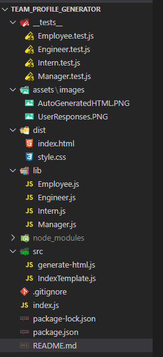
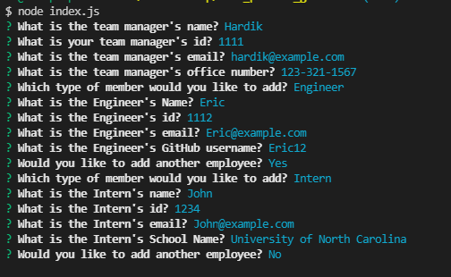
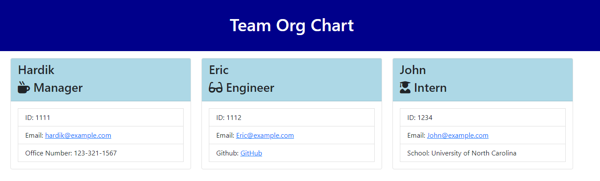

## Team Profile Generator

1. [ Description. ](#desc)
2. [ Web Address. ](#web-address)
3. [ Usage tips. ](#usage)
4. [ Features. ](#features)
5. [ Licenses. ](#licenses)
6. [ Install Command. ](#commandInstall)
7. [ Contributing. ](#contributing)
8. [ Questions. ](#questions)

### For license description, click on the badge to get more information.

## 1. Description

### Top technology used:  

This project was created command-line application using Node.js that takes in information about employees on a software engineering team, then generates an HTML webpage that displays summaries for each person.

## 2. How to Get There

### Open your favorite web browser and enter the following web address to access.

https://github.com/hrsautomation20/team_profile_generator

## 3. Usage Tips

Run node index.js and answer the prompts in command-line

## 4. Features

### File Structure

### How to run

### Sample team builder HTML

## 5. Licenses

## 6. Install Command

- Dependencies are Inquirer and Jest
- To Install dependencies open the Terminal and type "npm install" or "npm i"

## 7. Contributing

Please email Repo Owner or you can colon the repo.

## 8. Questions

Please reach out to me

GitHub Url: https://github.com/hrsautomation20

Email address: hrsautomation20@gmail.com
